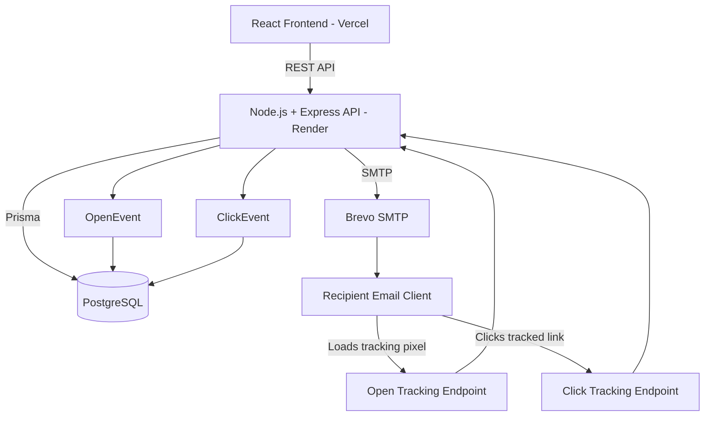
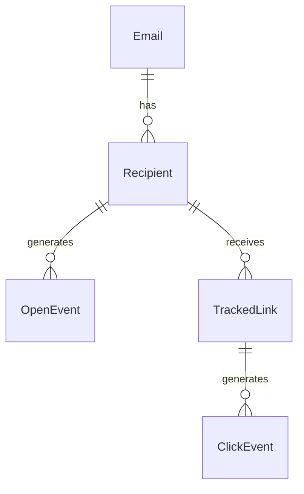
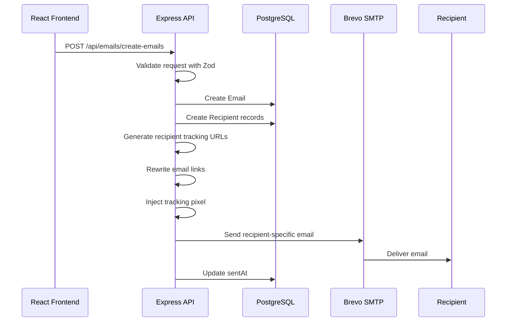
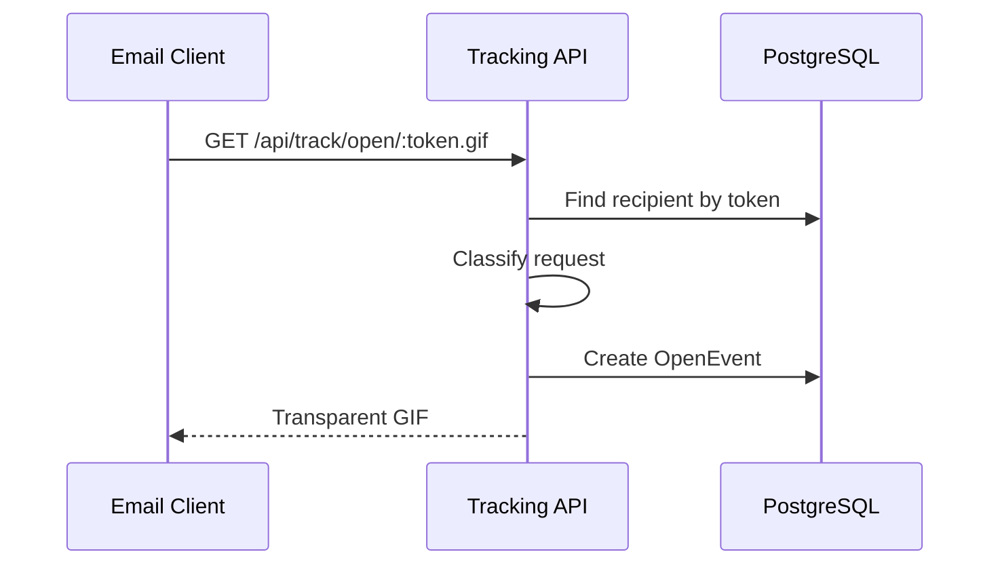
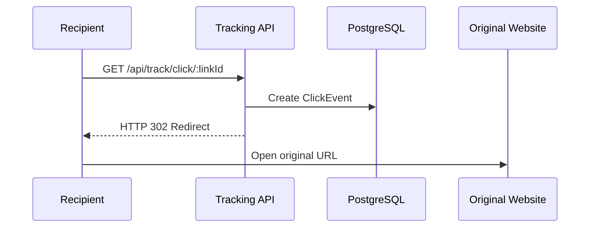
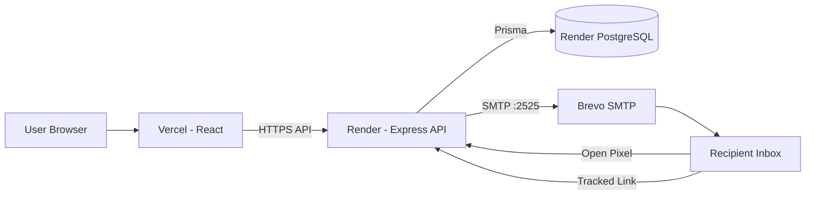

# PulseMail — Email Open & Engagement Tracker

A full-stack email engagement tracking application that allows users to send tracked emails and observe recipient-level engagement signals such as open events, first observed open time, open count, proxy/scanner activity, estimated dwell time, and tracked link clicks.

The project focuses on one of the main challenges of email analytics: **an image request does not necessarily mean a human opened an email**.

Instead of treating every tracking request as ground truth, PulseMail stores raw events, classifies suspicious activity, and presents engagement as observed signals with known limitations.

---

## Live Application

### Frontend

https://pulsemail-one.vercel.app

### Backend API

https://pulsemail-api.onrender.com

### GitHub

https://github.com/Bhavnish15/Email-Engagement-Tracker

---

# Features

- Compose and send HTML emails
- Send to one or multiple recipients
- Unique tracking token for every recipient
- Tracking-pixel based open detection
- First observed open timestamp
- Observed open count
- Proxy and scanner detection
- Estimated dwell time
- Dwell confidence
- Per-recipient engagement analytics
- Tracked link click detection
- First and last click tracking
- PostgreSQL persistence
- Request validation using Zod
- Backend unit tests with Vitest
- Responsive dashboard
- Production deployment

---

# Tech Stack

## Frontend

- React
- Vite
- JavaScript
- Tailwind CSS
- shadcn/ui
- Motion
- Lucide React

## Backend

- Node.js
- Express.js
- Nodemailer
- Zod
- Cheerio

## Database

- PostgreSQL
- Prisma ORM

## Testing

- Vitest

## Email Delivery

- Brevo SMTP

## Deployment

- Vercel — frontend
- Render — backend
- Render PostgreSQL — database

---

# Architecture



The application follows a modular backend structure where sending, tracking, analytics, persistence, and validation are separated into independent services.

---

# Project Structure

```text
Email-Engagement-Tracker/
│
├── client/
│   │
│   ├── src/
│   │   │
│   │   ├── api/
│   │   │   └── api.js
│   │   │
│   │   ├── components/
│   │   │   ├── AppSidebar.jsx
│   │   │   ├── ComposeEmail.jsx
│   │   │   ├── Dashboard.jsx
│   │   │   ├── StatCard.jsx
│   │   │   │
│   │   │   └── ui/
│   │   │       └── shadcn components
│   │   │
│   │   ├── App.jsx
│   │   ├── index.css
│   │   └── main.jsx
│   │
│   ├── .env
│   ├── components.json
│   ├── package.json
│   └── vite.config.js
│
├── server/
│   │
│   ├── prisma/
│   │   ├── migrations/
│   │   └── schema.prisma
│   │
│   ├── src/
│   │   │
│   │   ├── config/
│   │   │   └── prisma.js
│   │   │
│   │   ├── controllers/
│   │   │   ├── email.controller.js
│   │   │   └── tracking.controller.js
│   │   │
│   │   ├── middleware/
│   │   │   └── validate.js
│   │   │
│   │   ├── routes/
│   │   │   ├── email.routes.js
│   │   │   └── tracking.routes.js
│   │   │
│   │   ├── schemas/
│   │   │   └── email.schema.js
│   │   │
│   │   ├── services/
│   │   │   ├── analytics.service.js
│   │   │   ├── email.service.js
│   │   │   ├── linkTracking.service.js
│   │   │   └── tracking.service.js
│   │   │
│   │   └── app.js
│   │
│   ├── tests/
│   │   ├── schemas/
│   │   │   └── email.schema.test.js
│   │   │
│   │   └── services/
│   │       ├── analytics.service.test.js
│   │       └── tracking.service.test.js
│   │
│   ├── .env
│   ├── package.json
│   └── prisma.config.ts
│
├── .gitignore
└── README.md
```

---

# Database Design

The main entities are:



### Email

Stores the original email content.

Important fields:

```text
id
subject
bodyHtml
createdAt
sentAt
```

### Recipient

Represents an individual recipient of an email.

```text
id
emailAddress
trackingToken
sentAt
emailId
createdAt
```

Every recipient receives a unique `trackingToken`.

### OpenEvent

Represents an observed tracking-image request.

```text
id
timestamp
userAgent
ipHash
classification
recipientId
```

### TrackedLink

Represents a rewritten link inside an outgoing email.

```text
id
originalUrl
recipientId
createdAt
```

### ClickEvent

Represents an observed tracked-link request.

```text
id
timestamp
userAgent
trackedLinkId
```

---

# Email Sending Flow

When the user sends an email:



Each recipient receives a separate email because tracking identifiers and tracked links must be unique per recipient.

---

# Open Tracking

Open detection is implemented using a transparent tracking image.

Before sending, the backend appends an image similar to:

```html

```

When the email client requests the image:

```http
GET /api/track/open/:token.gif
```

the backend:

1. Reads the tracking token.
2. Finds the corresponding recipient.
3. Captures the request timestamp.
4. Captures the user agent.
5. Classifies the request.
6. Stores an `OpenEvent`.
7. Returns a transparent GIF.

---

## Open Tracking Flow



The application uses the term **open signal** rather than treating every request as proof of a human open.

---

# Open Classification

Tracking pixels are unreliable because automated systems can request email images.

Open events are classified as:

```text
HUMAN_LIKE
PROXY_OR_SCANNER
UNKNOWN
```

The classification service checks user-agent characteristics for common automated indicators such as:

```text
googleimageproxy
proofpoint
mimecast
barracuda
scanner
bot
crawler
spider
```

The timing of the request is also considered.

For example:

```text
Email sent:
10:00:00

Tracking request:
10:00:03
```

A request arriving almost immediately after delivery may be generated by an email proxy or security scanner.

The current implementation treats requests within a short threshold after delivery as suspicious.

This is only a heuristic and is not presented as absolute classification.

---

# Why Open Tracking Is Not Exact

A tracking pixel only proves:

> The tracking image URL was requested.

It does not necessarily prove:

> The recipient personally opened and read the email.

There are several reasons for this.

---

## Gmail Image Proxy

Gmail can fetch external images through Google's infrastructure.

As a result, the request reaching the backend may come from Google's proxy rather than directly from the recipient.

This means details such as:

```text
IP address
location
device
browser
```

cannot reliably identify the recipient.

---

## Image Prefetching

Some providers preload images before the recipient actually opens the message.

This can produce an open signal immediately after delivery.

Therefore:

```text
Tracking request
```

does not always mean:

```text
Human open
```

---

## Security Scanners

Corporate email systems frequently scan incoming messages before delivering them.

Security products may automatically request external resources.

This can create false open signals.

---

## Image Blocking

Some email clients block remote images.

A user may therefore:

```text
Open email
Read email
Close email
```

without the tracking pixel ever loading.

Because of this, the dashboard uses:

```text
No signal
```

instead of:

```text
Not opened
```

when no tracking event exists.

---

## Image Caching

Email providers may cache remote images.

If a recipient opens an email multiple times, the provider may reuse the cached image instead of requesting the tracking URL again.

Therefore:

```text
Observed open count
```

is not guaranteed to equal:

```text
Actual human open count
```

---

# Dwell-Time Estimation

Email clients do not provide a reliable event when an email is:

```text
closed
minimized
scrolled away
no longer visible
```

JavaScript execution inside email clients is also heavily restricted.

Therefore exact dwell time cannot be measured in the same way as a normal web application.

PulseMail provides an approximation based on observed usable events.

---

## Current Calculation

Events classified as obvious proxy/scanner activity are excluded.

If fewer than two usable events exist:

```text
Estimated dwell:
Unknown

Confidence:
INSUFFICIENT_DATA
```

If multiple usable events exist:

```text
Estimated Dwell =
Last usable event timestamp
-
First usable event timestamp
```

Example:

```text
First usable event:
10:15:20

Last usable event:
10:15:54

Estimated dwell:
~34 seconds
```

Very large time gaps are discarded because they are unlikely to represent continuous reading.

The estimate is intentionally presented with low confidence rather than being called exact reading time.

---

# Link Tracking

PulseMail also records link interactions.

Before sending, normal links are rewritten.

Original:

```html
<a href="https://github.com">
  View Project
</a>
```

Tracked version:

```text
https://pulsemail-api.onrender.com/api/track/click/TRACKED_LINK_ID
```

When the recipient clicks the link:



The click event is stored before the recipient is redirected.

Click tracking is an additional engagement signal and is kept separate from email-open estimation.

---

# Analytics

The analytics service converts raw database events into recipient-level analytics.

Example:

```json
{
  "emailAddress": "recipient@example.com",
  "openDetected": true,
  "observedOpenCount": 2,
  "firstOpenAt": "2026-10-03T10:30:00Z",
  "humanLikeCount": 0,
  "proxyOrScannerCount": 1,
  "unknownCount": 1,
  "estimatedDwellSeconds": null,
  "dwellConfidence": "INSUFFICIENT_DATA",
  "clickDetected": true,
  "clickCount": 1
}
```

Raw events are kept in the database instead of storing only aggregated counters.

This allows the analytics logic to be improved or recalculated later.

---

# API Endpoints

## Email

```http
POST /api/emails/create-emails
```

Creates the email, creates recipient records, adds tracking, and sends the messages.

```http
GET /api/emails
```

Returns sent emails with recipient events.

```http
GET /api/emails/:id/analytics
```

Returns calculated engagement analytics.

---

## Tracking

```http
GET /api/track/open/:token.gif
```

Records an open signal and returns the tracking image.

```http
GET /api/track/click/:linkId
```

Records a click and redirects to the original destination.

---

## Health

```http
GET /api/health
```

API health check.

```http
GET /api/db-health
```

Database connection health check.

---

# Request Validation

Incoming email requests are validated using Zod before reaching the controller.

The schema validates:

- subject
- HTML body
- recipient list
- email address format
- recipient limits

Example invalid request:

```json
{
  "subject": "",
  "bodyHtml": "",
  "recipients": [
    "invalid-email"
  ]
}
```

returns a `400` validation response instead of allowing invalid data into the application.

---

# Testing

Vitest is used to test backend business logic.

Current tests cover:

### Tracking Classification

- scanner user agents
- immediate tracking requests
- unknown events

### Analytics

- no-open state
- observed open counts
- first event calculation
- last event calculation

### Validation

- valid email payload
- invalid email address
- empty recipient list
- empty subject

Run tests with:

```bash
cd server

npm test
```

Current test suite:

```text
Test Files  3 passed
Tests       9 passed
```

---

# Deployment Architecture



### Frontend

Hosted on Vercel:

```text
https://pulsemail-one.vercel.app
```

### Backend

Hosted on Render:

```text
https://pulsemail-api.onrender.com
```

### Database

PostgreSQL hosted on Render.

### Email Delivery

Brevo SMTP using port `2525`.

---

# Environment Variables

## Backend

```env
DATABASE_URL=

CLIENT_URL=

PUBLIC_API_URL=

SMTP_HOST=smtp-relay.brevo.com
SMTP_PORT=2525

SMTP_USER=
SMTP_PASS=
EMAIL_FROM=
```

Example production values:

```env
CLIENT_URL=https://pulsemail-one.vercel.app

PUBLIC_API_URL=https://pulsemail-api.onrender.com
```

Secrets such as database credentials and SMTP keys are not stored in the repository.

---

## Frontend

```env
VITE_API_URL=https://pulsemail-api.onrender.com
```

---

# Running Locally

## Backend

```bash
cd server

npm install

npx prisma generate

npx prisma migrate dev

npm run dev
```

Backend runs at:

```text
http://localhost:5000
```

---

## Frontend

```bash
cd client

npm install

npm run dev
```

Frontend runs at:

```text
http://localhost:5173
```

---

# Engineering Decisions

## Store Raw Events Instead of Counters

Instead of storing only:

```text
openCount = 5
```

the system stores five individual `OpenEvent` records.

This preserves:

- timestamps
- classifications
- user agents
- event history

and allows analytics logic to change without losing the original data.

---

## Per-Recipient Tracking

Tracking identifiers are generated at the recipient level rather than the email level.

This makes it possible to independently calculate engagement for every recipient.

---

## Send Emails Individually

Each recipient gets their own copy of the email because:

```text
tracking token
tracked links
sent timestamp
analytics
```

must remain recipient-specific.

---

## Modular Monolith

The application is currently a modular monolith rather than microservices.

For the current scale, splitting email, tracking, and analytics into separate network services would introduce unnecessary deployment and operational complexity.

The code is separated into services so those responsibilities could be extracted later if required.

---

# Known Limitations

The tracking system intentionally does not present its metrics as guaranteed truth.

Important limitations include:

- Gmail image proxying
- image caching
- image prefetching
- corporate security scanners
- antivirus scanners
- blocked images
- privacy-focused email clients
- no reliable email-close event
- no reliable direct dwell-time measurement

For these reasons, the application uses terminology such as:

```text
Open signal
First observed
Observed opens
Proxy suspected
No signal
Estimated dwell
```

instead of:

```text
Definitely opened
Definitely not opened
Exact read count
Exact reading time
```

---

# Future AI Use

If I continued building PulseMail, I would use AI primarily to improve the interpretation of engagement signals rather than simply adding a chatbot.

The main challenge in email analytics is not collecting events — it is deciding what those events actually mean.

A future engagement model could combine:

- request timing
- known proxy patterns
- user-agent characteristics
- repeated open events
- click events
- previous recipient behavior
- suspicious automated patterns

and generate an engagement confidence score.

For example:

```text
Likely Human Engagement

Confidence: 78%

Evidence:
✓ confirmed link interaction
✓ delayed image request

Possible noise:
⚠ one immediate proxy-like request
```

This would help users understand both the engagement signal and the uncertainty behind it.

AI could also summarize campaign-level behavior, for example:

```text
Most recipients interacted within the first hour.

Approximately 30% of image requests appear automated.

Recipients who clicked links generally interacted later than
the initial image-request signals.
```

The objective would be to make noisy tracking data easier to understand rather than pretending that imperfect measurements are exact.

---

# Product Differentiation

The main feature I would build to differentiate PulseMail from traditional email tracking products is an:

## Engagement Confidence Engine

Instead of showing only:

```text
Opened: Yes

Opened 4 times
```

PulseMail could show:

```text
Observed open signals: 4

Likely automated: 2

Human-like: 1

Unknown: 1

Confirmed clicks: 1

Engagement confidence:
MEDIUM
```

The product could also explain why:

```text
One request occurred immediately after delivery and
was likely generated automatically.

A later request did not match known scanner behavior.

A confirmed link interaction was also recorded.
```

The goal would be to make email engagement analytics more transparent about uncertainty rather than simply reporting larger numbers with false precision.

---

# Possible Future Improvements

- User authentication
- Campaign grouping
- Campaign details page
- Recipient engagement timeline
- CSV recipient import
- Rich-text email editor
- scheduled email delivery
- bounce tracking
- unsubscribe management
- background email queues
- retry handling
- structured logging
- stronger proxy classification
- engagement confidence scoring
- campaign-level analytics
- custom tracking domains
- production transactional-email provider configuration
- authentication and per-user data isolation

---

# Final Note

A tracking pixel is technically simple:

```text
Send email
   ↓
Image requested
   ↓
Store event
```

The difficult part is interpreting that request correctly.

Email providers intentionally use caching, proxying, prefetching, image blocking, and privacy protections that make exact open tracking impossible.

PulseMail therefore stores the raw events and treats them as **observed engagement signals with limitations**, rather than presenting them as guaranteed user behavior.
